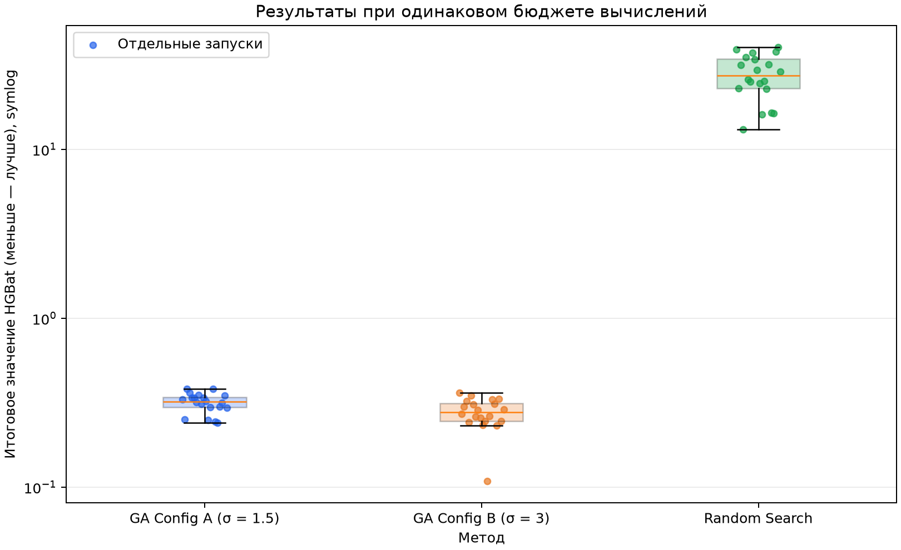
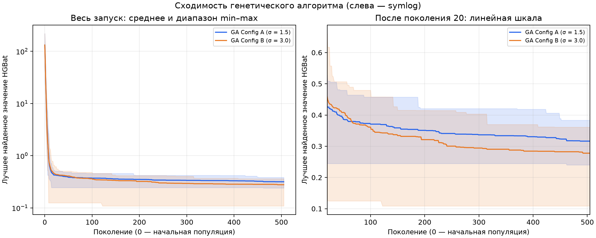

# Лабораторная работа №1

**Дисциплина:** «Эволюционное программирование и генетические алгоритмы».

## 1. Постановка задачи

Разработать собственный вещественный генетический алгоритм для приближённой
глобальной минимизации HGBat. Исследовать влияние масштаба гауссовской мутации
и сравнить алгоритм с независимым равномерным случайным поиском при равном бюджете.

## 2. Индивидуальный вариант

Вариант 20; функция HGBat; размерность $d=7$; границы каждой координаты от −15 до 15.

## 3. Математическая постановка

$$\min_{x\in[-15,15]^7} f(x).$$

Качество решения определяется значением $f(x)$: меньшее значение лучше.
Ограничение вычислительного ресурса — 50 000 обращений к целевой функции на запуск.

## 4. Функция HGBat

Пусть $q=\sum_{i=1}^{d}x_i^2$, $s=\sum_{i=1}^{d}x_i$. Тогда

$$f(x)=\sqrt{|q^2-s^2|}+\frac{0.5q+s}{d}+0.5.$$

Вторая часть равна $\frac{1}{2d}\sum_i(x_i+1)^2$, поэтому оба слагаемых
неотрицательны. В точке $x^*=(-1,\ldots,-1)$ они равны нулю, откуда
$f(x^*)=0$ — глобальный минимум. Квадратичная часть обращается в ноль только
в этой точке. В реализации используется исходная формула из задания.
Знание оптимума не включается в инициализацию, селекцию, мутацию или остановку.

## 5. Пространство решений

Допустимое множество — непрерывный семимерный куб $[-15,15]^7$.
Конечный набор случайных проб не покрывает его целиком: получение небольшого
значения функции требует направленного использования уже найденных решений.

## 6. Представление особи

Особь — массив NumPy из семи вещественных координат. Популяция — матрица
размера $100\times7$. Отдельный вектор содержит значения целевой функции.
Бинарное кодирование и преобразование минимизации в максимизацию не применяются.

## 7. Структура генетического алгоритма

Инициализация → оценка → сохранение лучшего решения → повторение:
селекция родителей → кроссовер → мутация → clipping → оценка потомков →
формирование поколения с элитой → обновление рекорда и истории.
Все операторы выделены в отдельные функции `src/genetic_algorithm.py`.
После исчерпания бюджета возвращаются лучший вектор, значение, seed,
число оценок, число поколений и история сходимости.

## 8. Инициализация

Каждая координата каждой особи независимо генерируется из $U(-15,15)$
с помощью локального `numpy.random.default_rng(seed)`.
Оценка начальных 100 особей включена в общий бюджет.

## 9. Оценка качества

`src/objective.py` вычисляет исходную HGBat и возвращает `float`.
`evaluate_population` вызывает её ровно один раз для каждой переданной особи.
Для неизменённых старых особей сохраняются ранее вычисленные значения.
Среднее и худшее значения в истории относятся к текущей популяции;
`global_best_fitness` — к лучшему решению за весь запуск.

## 10. Турнирная селекция

В каждом турнире равновероятно выбираются три разных индекса популяции без
возвращения. Побеждает особь с минимальной HGBat. Турниры независимы,
поэтому одна особь может многократно становиться родителем.
При равных оценках выбирается первый минимум в случайном порядке участников.

## 11. Арифметический кроссовер

С вероятностью 0.9 для пары родителей генерируется одно $\alpha\sim U(0,1)$:

$$c_1=\alpha p_1+(1-\alpha)p_2,\quad c_2=(1-\alpha)p_1+\alpha p_2.$$

Один коэффициент применяется ко всем координатам пары. Если кроссовер не
произошёл, возвращаются независимые копии родителей. При нечётном числе
необходимых потомков лишний второй потомок не оценивается.

## 12. Гауссовская мутация

Для каждой координаты независимо с вероятностью $p_m=1/7$:

$$x_i\leftarrow x_i+\varepsilon_i,\qquad\varepsilon_i\sim N(0,\sigma^2).$$

В среднем изменяется одна координата на потомка, однако возможны как ноль,
так и несколько изменений. Для Config A $\sigma=1.5$, для Config B $\sigma=3.0$.
Масштаб не адаптируется по поколениям.

## 13. Обработка границ

После мутации применяется `np.clip(child, -15, 15)`.
Вышедшая за границу координата заменяется ближайшей границей; допустимая
координата сохраняется. Clipping прост, но может накапливать значения на границе.

## 14. Элитизм

Лучшая особь переносится в следующее поколение без изменения и переоценки.
Поэтому лучшее значение популяции не возрастает. Дополнительно сохраняется
рекорд всего запуска: он корректен и при пользовательской настройке `elite_count=0`.

## 15. Критерий остановки

Каждый метод выполняет ровно 50 000 оценок HGBat. Для ГА начальная популяция
требует 100 оценок, каждое полное обновление — 99. Выполняются 504 полных
обновления и последнее неполное с 4 потомками: $100+504\cdot99+4=50000$.
В последнем поколении сохраняются 96 лучших старых особей; остальные четыре
места занимают оценённые потомки. Размер популяции остаётся равным 100.
В истории 506 строк на запуск: инициализация и 505 обновлений.

## 16. Параметры алгоритма

| Параметр | Config A | Config B |
|---|---:|---:|
| Размерность | 7 | 7 |
| Границы | [−15, 15] | [−15, 15] |
| Популяция | 100 | 100 |
| Турнир | 3 | 3 |
| Вероятность кроссовера | 0.9 | 0.9 |
| Вероятность мутации координаты | 1/7 | 1/7 |
| Sigma | 1.5 | 3.0 |
| Число элитных особей | 1 | 1 |
| Бюджет | 50 000 | 50 000 |

## 17. Методика экспериментов

Для каждого из трёх методов используются 20 запусков с seed 0–19.
Каждый запуск создаёт собственный генератор. Серии используют одинаковый
набор seed для сопоставимости; A/B также начинают с одинаковых популяций.
Конфигурации A/B отличаются только sigma. Random Search генерирует каждый
вектор независимо и равномерно; он не применяет операторов ГА.
Суммарный бюджет полной серии — 3 000 000 оценок функции.
Сравнение проводится по числу оценок, а не по процессорному времени.
Параметры и версии окружения сохранены в `results/summary/experiment_metadata.json`.

## 18. Сравнение двух масштабов мутации

Среднее Config A равно 0.31638255, Config B — 0.27779741; для B оно ниже на 12.20%. Медианы: 0.32034407 и 0.27866543. При попарном сравнении одинаковых seed Config B лучше в 14 из 20 случаев. Таким образом, в этой серии больший масштаб мутации оказался полезнее по среднему и медиане. Возможное объяснение — более крупные изменения позволяют исследовать другие области при сужении популяции. Это интерпретация наблюдений, а не доказательство механизма или статистической значимости различий.

## 19. Сравнение с Random Search

Среднее Random Search равно 27.72310635, тогда как у ГА — 0.31638255 (A) и 0.27779741 (B). Отношения средних RS/A и RS/B составляют 87.63 и 99.80. Это отношения значений функции, не ускорение по времени. Даже лучший результат Random Search (13.09608352) хуже худших результатов обеих конфигураций ГА в данной серии. Использование информации о хороших особях оказалось существенно эффективнее независимого равномерного поиска при данном бюджете.



## 20. Статистика результатов

Выборочное стандартное отклонение рассчитывается единообразно, `ddof=1`:

$$s=\sqrt{\frac{1}{n-1}\sum_{j=1}^{n}(f_j-\bar f)^2}.$$

| Метод | Best | Mean | Median | Std (ddof=1) | Worst |
|---|---:|---:|---:|---:|---:|
| ga_config_a | 0.24022419 | 0.31638255 | 0.32034407 | 0.04321959 | 0.38330523 |
| ga_config_b | 0.10875203 | 0.27779741 | 0.27866543 | 0.05590044 | 0.36115379 |
| random_search | 13.09608352 | 27.72310635 | 27.38059036 | 8.24882193 | 40.31726710 |

Все числа относятся к итоговым значениям лучшего решения каждого запуска.
Исходные данные доступны в трёх итоговых CSV; отдельные координаты записаны
в столбцы `x1`–`x7`. Отчёт округляет числа для чтения; CSV сохраняют большую точность.

## 21. Анализ сходимости



На графике показаны средние траектории и диапазон от минимума до максимума
по 20 seed. Этот диапазон не является доверительным интервалом.
Слева используется шкала symlog с линейной областью около нуля (`linthresh=0.0001`); справа — линейная шкала для подробного сравнения после 20-го поколения.
В финальном boxplot линия — медиана, коробка — межквартильный диапазон,
усы — до 1.5 IQR; все наблюдения дополнительно показаны точками.

**ga_config_a:** среднее лучшее значение при поколении 0 — 131.67735416, при поколении 20 — 0.42652908, при поколении 100 — 0.37081652, в конце — 0.31638255.

**ga_config_b:** среднее лучшее значение при поколении 0 — 131.67735416, при поколении 20 — 0.45839712, при поколении 100 — 0.36136074, в конце — 0.27779741.

Основное снижение приходится на первые поколения; затем улучшения замедляются. Невозрастание траекторий обеспечено элитизмом, но само по себе не означает достижения глобального минимума.

## 22. Анализ устойчивости

Выборочное стандартное отклонение Config A — 0.04321959, Config B — 0.05590044; у B разброс больше. Диапазоны итогов: [0.24022419; 0.38330523] и [0.10875203; 0.36115379]. Для Random Search std = 8.24882193, диапазон [13.09608352; 40.31726710]. Меньший разброс A сопровождается худшим средним результатом. Поэтому устойчивость и качество нужно обсуждать отдельно; единичный лучший запуск не заменяет сравнения всех повторов.

Одинаковый seed, конфигурация и окружение воспроизводят траекторию.
Изменение seed может менять результат. Выполнены автоматические проверки
формулы, границ, операторов, элиты, размера популяции, точного числа вызовов
функции, повторяемости, однофакторности A/B и создания CSV/PNG.

## 23. Почему HGBat является сложной задачей поиска

Выражение под корнем связывает все координаты через $q$ и $s$, поэтому их
эффекты нельзя оценивать независимо. Абсолютная величина и квадратный корень
создают негладкое поведение на поверхности $q^2=s^2$. Малые изменения около
хорошего решения могут сильно менять первый член. Арифметический кроссовер
ограничен отрезком между родителями и сужает разнообразие; мутация должна
одновременно поддерживать исследование и достаточно точное уточнение.
Семимерная область также затрудняет попадание случайного поиска в малую
окрестность оптимума при ограниченном бюджете.

## 24. Ограничения реализации

ГА — эвристика без гарантии достижения глобального минимума за конечный бюджет.
Фиксированная sigma не учитывает стадию поиска; адаптация, перезапуски и
локальные оптимизаторы намеренно не включены в этот однофакторный эксперимент.
Рассмотрены одна функция, одна размерность и один бюджет. Двадцать повторов
дают эмпирическую оценку разброса, но не доказывают превосходство на других задачах.
Проверка статистической значимости различий не проводилась.
Полная побитовая воспроизводимость между версиями библиотек и платформами
не гарантируется; использованные версии зафиксированы.

## 25. Вывод

Реализованы собственный ГА и Random Search, выполнены все 60 полных запусков. Обе конфигурации ГА превзошли случайный поиск по всем итоговым наблюдениям этой серии. Config B лучше по среднему и медиане, Config A имеет меньший разброс.

Лучшее решение: **ga_config_b, seed=12**:

```text
x = (-0.5629802083, -0.6113554848, -0.9164478511, -0.3312755155, -1.1997723413, -0.5434610490, -1.5198950187)
f(x) = 0.108752033720
||x - x*||₂ = 1.146661191339
```

Точный теоретический минимум не достигнут. Цель реализации и сравнительного эксперимента выполнена, однако полученное решение остаётся приближённым. Дальнейшее исследование может рассмотреть адаптацию sigma и увеличение бюджета как отдельные эксперименты. Текущие результаты не подменялись настройкой алгоритма под известный оптимум.
